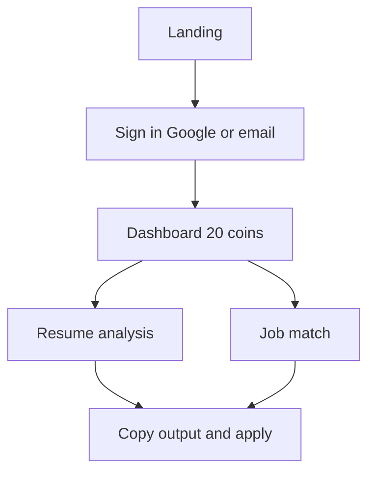
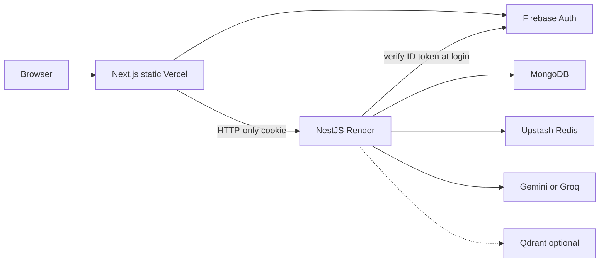

# Interview / portfolio workflow

How to walk through [AICareerCopilot](https://ai-career-copilot-hazel.vercel.app) in an interview. Product and run docs: [README.md](README.md).

---

## 30-second pitch

I built a usage-metered SaaS for job seekers. You sign in, analyze a resume for ATS, then score it against a real job description. The headline match percent is not a raw LLM guess — the model extracts evidence, and TypeScript computes the score. Coins are charged only on success. Frontend is Next.js on Vercel; API is NestJS on Render; Firebase Auth, MongoDB, Redis sessions, optional Qdrant RAG.

---

## Problem → product

- Candidates get generic ChatGPT rewrites with no ATS signal and no proof they match a specific posting.
- Hiring software still filters on keywords and structure.
- This product ties feedback to **their document + that JD**, with a coin meter so it looks like a real SaaS, not a prompt demo.

**What it is not:** no interview-prep module, no LinkedIn import, no auto-apply. The loop ends at “copy output → apply yourself.” (`interviewCoins` is the currency name, not an interview feature.)

---

## User workflow (tell this first)

1. **Sign in** — Firebase Google or email/password; password reset / verification stay in Firebase.
2. **Dashboard** — coin balance, shortcuts ([frontend/src/app/dashboard/page.tsx](frontend/src/app/dashboard/page.tsx)).
3. **Resume** — PDF or paste, optional target role → critique, ATS notes, strengths/gaps, rewrite ([frontend/src/app/resume/page.tsx](frontend/src/app/resume/page.tsx)). **10 coins** on success; **0** on failure.
4. **Job match** — paste JD + resume → fit %, missing requirements, tailored bullets ([frontend/src/app/job-match/page.tsx](frontend/src/app/job-match/page.tsx)). Same coin rules; **identical hash is free**.
5. **Billing** — Stripe coin packs when keys exist; otherwise starting grant ([frontend/src/app/billing/page.tsx](frontend/src/app/billing/page.tsx)).

Identity: one Firebase user, one Mongo profile, one coin balance. Google and password can be **linked**; emails are **never auto-merged**.

---

## System workflow (whiteboard this second)

**Auth tenancy**

- Browser sends Firebase **ID token only** to `POST /api/v1/auth/login`.
- API verifies with Firebase Admin, `findOrCreate` Mongo by `firebaseUid`.
- Session is an **opaque HTTP-only cookie** in Redis — not `localStorage`.
- API `userId` comes from the session, never from the request body.

**Resume pipeline** ([backend/src/ai/langgraph/resume/graph.ts](backend/src/ai/langgraph/resume/graph.ts))

Extract → normalize → optional RAG → LLM analyze → Zod validate/retry → ATS (hybrid) → recommendations → **charge 10 coins** → persist.

Optional BullMQ (`RESUME_QUEUE_ENABLED`): `202` + poll `GET /resume/status/:jobId`. Production default is inline.

**Job-match pipeline**

Content-hash cache (hit = free) → optional RAG → structured LLM → **evidence-weighted score in code** ([backend/src/job-match/job-match.score.ts](backend/src/job-match/job-match.score.ts)) → charge → persist.

**RAG**

Labor-market snippets from Qdrant injected into prompts. If off/misconfigured: empty citations, analysis still runs — do not invent market facts.

---

## Stack (SaaS slice)

| Layer | Choice |
|--------|--------|
| UI | Next.js 16 static export, React 19, Vercel |
| API | NestJS 11, Docker, Render |
| Auth | Firebase + Redis sessions |
| Data | MongoDB Atlas (users, analyses, matches, billing ledger) |
| Cache | Upstash Redis |
| AI | LangChain + LangGraph; Gemini or Groq |
| Retrieval | Qdrant (optional) |
| Payments | Stripe coin packs |

---

## Talking points

1. **Hybrid scoring** — LLM extracts evidence; TypeScript owns the % so a polished wrong-stack resume cannot score 90+.
2. **Structured LLM** — Zod schemas + LangGraph retry; fail closed rather than ship invalid JSON.
3. **Metering** — charge after success; refund if persist fails; cache hits free.
4. **Degrade gracefully** — no Mongo → memory stores; no RAG → empty context; no LLM keys → mock (dev/tests).
5. **Split deploy cookies** — `SameSite=None` + HTTPS so Vercel can call Render with credentials.
6. **Store interfaces** — Mongo vs memory for tests without a DB.

**STAR closer:** I treated this as a product, not a notebook: auth, tenancy, usage billing, LLM orchestration, and production deploy with RAG as an optional capability.

---

## Likely probes

- Why not trust the model’s score? → Calibration and stack-conflict caps in `job-match.score.ts`.
- Why Firebase + Redis instead of JWT only? → Credential provider vs API session; revoke by deleting Redis key; no session id in JS storage.
- Why static export? → Cheap hosting; API stays independent.
- What’s next? → Interview prep / tracker are **not** built; next would be those or turning RAG on in prod after ingest.
