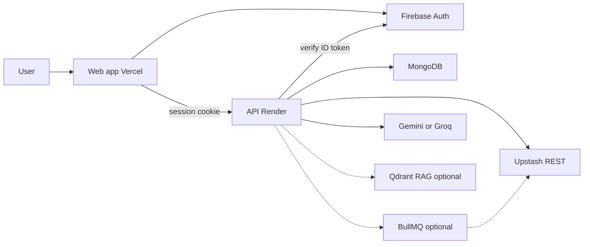

# AICareerCopilot

**SaaS for job seekers:** critique a resume, rewrite for ATS, and score fit against any job description — then apply with numbers you can defend.

This is a shipped product (and a portfolio case study of a full-stack AI SaaS): accounts, usage metering, LLM pipelines, optional market RAG, optional BullMQ resume jobs, and production deploy. Short pitch: [PORTFOLIO.md](PORTFOLIO.md). Full system flow (technical interview): [SYSTEM_FLOW.md](SYSTEM_FLOW.md).

| | |
|---|---|
| **App** | [ai-career-copilot-hazel.vercel.app](https://ai-career-copilot-hazel.vercel.app) |
| **API** | [ai-career-copilot-7iee.onrender.com](https://ai-career-copilot-7iee.onrender.com) |
| **Support** | [wandertech58@gmail.com](mailto:wandertech58@gmail.com) · [/contact](https://ai-career-copilot-hazel.vercel.app/contact) |

---

## Problem

Job seekers rewrite resumes in the dark: generic ChatGPT output, no ATS signal, no proof they match a specific posting. Hiring software still filters on keywords and structure. Candidates need **role-specific** feedback tied to **their** document, not a generic essay.

## Solution

AICareerCopilot is a **usage-based SaaS workspace**:

1. Sign in (Google or email).  
2. Analyze a resume (PDF or paste).  
3. Match it to a real job description.  
4. Pay in **coins** only when a run succeeds.

Identity is one Firebase user, one Mongo profile, one coin balance. Google and password can be linked on the same account; emails are never auto-merged.

---

## Product surface

| Module | What the user gets |
|--------|-------------------|
| **Dashboard** | Coins, shortcuts to resume and job match |
| **Resume analysis** | ATS notes, critique, strengths/gaps, rewrite direction, parsed profile |
| **Job match** | Fit score, missing requirements, bullets that close gaps |
| **Account** | Linked sign-in methods (Google / email-password), coins |
| **Billing** | Coin packs (Stripe when connected; otherwise starting grant) |
| **Contact** | Support mailto |

**Metering:** 20 coins on signup · 10 coins per successful analysis · 0 on failure · cached identical job-match is free.

---

## Customer journey

```text
Land → Sign in
         │
         ▼
    Dashboard (20 coins)
         │
         ├─ Resume  →  PDF/text + optional target role
         │              critique · ATS · rewrite
         │
         └─ Job match  →  JD + resume
                        score · gaps · tailored bullets
         │
         ▼
    Copy output → apply
```

Password reset and email verification are handled by Firebase (link in email, then return to the app).

---

## How the platform works



### Auth and tenancy

- Client signs in with Firebase; browser sends **ID token only**.  
- API verifies with Firebase Admin, then `findOrCreate` Mongo by **`firebaseUid`**.  
- Session is an **HTTP-only cookie** (Redis/Upstash). No session id in `localStorage`.  
- Coins live on the user document; the client cannot pick another UID.

### Resume pipeline

Extract text → normalize → **optional RAG retrieve** → LLM analyze → validate/retry → ATS → recommendations → **charge 10 coins** → persist.

### Job match pipeline

Content-hash cache (hit = free) → **optional RAG** → structured LLM → **evidence-weighted score in code** → charge → persist.

The headline match % is finalized from requirement evidence (`job-match.score.ts`), not a raw model guess.

### Resume queue (BullMQ)

Resume analysis can run **inline** (default) or on **BullMQ**.

| Mode | When | HTTP |
|------|------|------|
| Inline | `RESUME_QUEUE_ENABLED` is false (production default on a single Render instance) | `200` + analysis body |
| Queued | `RESUME_QUEUE_ENABLED=true` and a Redis protocol URL (`REDIS_URL` / `UPSTASH_REDIS_URL`) | `202` + `jobId`; poll `GET /api/v1/resume/status/:jobId` |

`RESUME_QUEUE_WORKER` (default true when the queue is on) runs the worker in the same process. Sessions and cache stay on **Upstash Redis REST**; BullMQ needs `redis://` or `rediss://`, not the REST URL. Custom job ids use `__` not `:` (BullMQ key separator).

---

## RAG (market context)

RAG is a **product capability**, not a demo stub. Labor-market snippets (skills, roles, sources) can be retrieved from Qdrant and injected into resume and job-match prompts.

**Live cloud may run with RAG off** until Qdrant is ingested. Features still return analysis; market citations are empty rather than invented.

| Mode | Behavior |
|------|----------|
| On (`RAG_ENABLED` + Qdrant + ingest) | Embed query, retrieve hits, attach market signals / gaps / citations |
| Off or misconfigured | Empty context; critique, ATS, and match still run |

Ingest: `npm run rag:ingest` (from `backend/`). Embeddings (`mock` or `gemini`) must match what was ingested.

---

## Stack (portfolio)

| Layer | Choice |
|-------|--------|
| Product UI | Next.js, static export, Vercel |
| API | NestJS, Docker, Render |
| Auth | Firebase (Google + email/password + linking) |
| Data | MongoDB Atlas (users, analyses) |
| Session / cache | Upstash Redis REST |
| Jobs | BullMQ (opt-in resume analysis) |
| AI | Gemini or Groq; LangGraph-style resume graph |
| Retrieval | Qdrant (optional RAG) |
| Payments | Stripe coin packs (code ready; keys optional) |

This is the architecture you’d show as a **full SaaS slice**: auth, billing primitives, optional BullMQ jobs, LLM orchestration, and graceful RAG degrade.

---

## Pricing (SaaS)

Coin-metered, not a monthly seat (current model):

| Event | Coins |
|-------|-------|
| New account | +20 |
| Successful resume or job-match run | −10 |
| Failed run | 0 |
| Repeat job match (same hash) | 0 |

Stripe packs (Starter / Plus / Pro) appear when billing keys are configured.

---

## Trust

Resumes are used to generate **that user’s** results, not to train public models in this product. Passwords never touch MongoDB. Production cookies are `SameSite=None` + HTTPS so Vercel can talk to Render.

---

## Run locally

Node 20+, Docker, Firebase project.

```bash
npm run install:all
cp backend/.env.example backend/.env
cp frontend/.env.example frontend/.env.local
docker compose up -d
npm run dev
```

App: http://localhost:3000 · API: http://localhost:3001 (`/` and `/api/v1/health`).

Templates: `backend/.env.example`, `frontend/.env.example` (local only). Do not commit secrets or `firebase-adminsdk.json`.

**Production:** Vercel (`NEXT_PUBLIC_API_URL`, Firebase public config) + Render (`CORS_ORIGIN` / `FRONTEND_URL` = exact UI origin, Mongo, Upstash, LLM keys). Set `RAG_ENABLED=true` only after Qdrant + ingest. Keep `RESUME_QUEUE_ENABLED=false` on a single Render instance unless you also set `REDIS_URL`.

---

## API (authenticated unless noted)

`/api/v1` — `POST /auth/login` `{ idToken }` · `GET /auth/me` · `POST /auth/logout` · `GET /health` · resume analyze/upload/extract · `GET /resume/status/:jobId` (when queued) · `POST /job-match/score` · `GET /billing/packs`.

---

## Repo

```text
frontend/       Product UI
backend/        API, LangGraph resume, job match
  src/queue/    BullMQ resume jobs (opt-in)
  src/rag/      Qdrant ingest + retrieve
render.yaml     API (and optional web) Docker
PORTFOLIO.md    Short interview pitch
SYSTEM_FLOW.md  Full system flow for technical interviews
```

---

## Contact

**wandertech58@gmail.com** · in-app Contact. API notes: [backend/README.md](backend/README.md).
