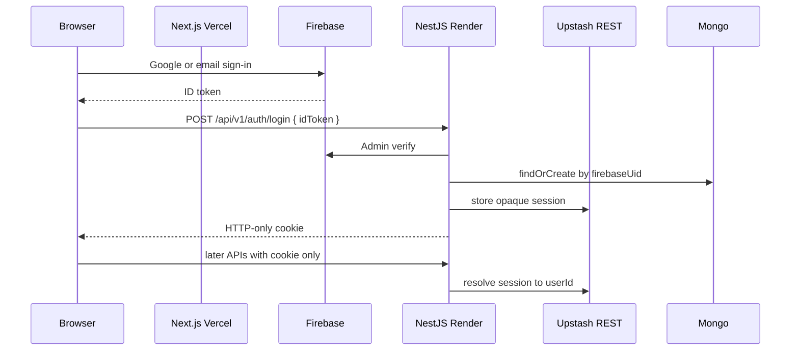
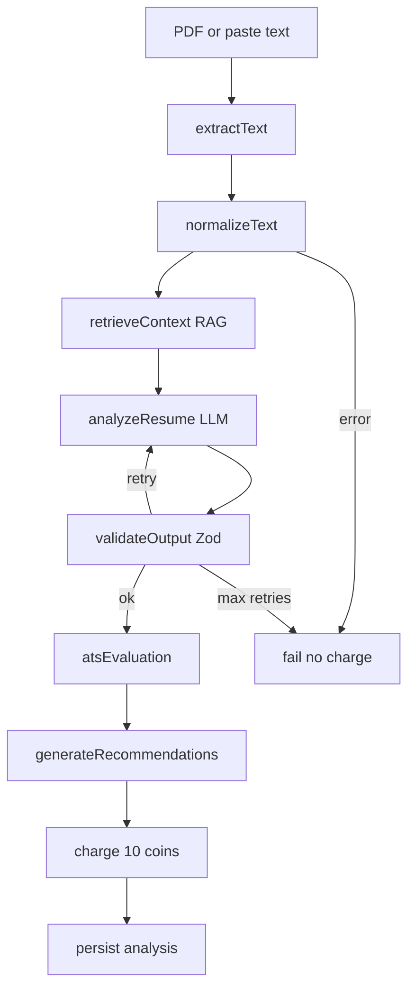
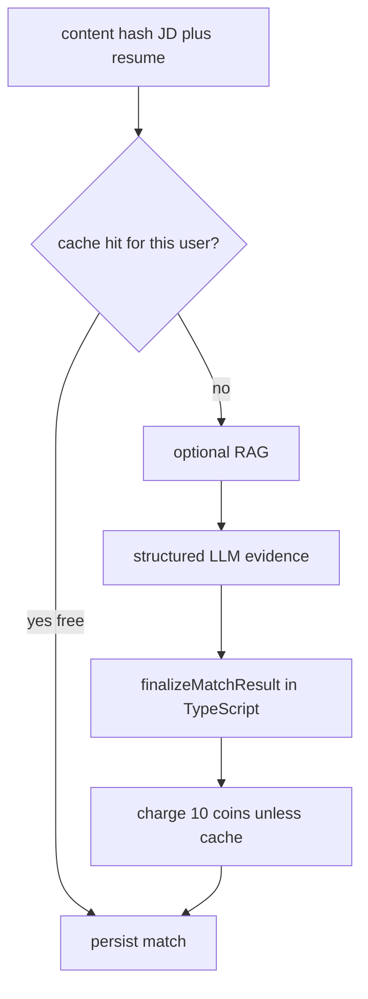
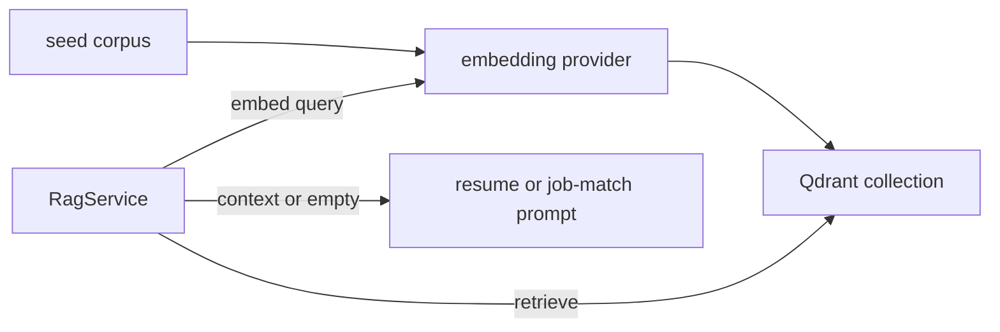

# System flow (technical interview)

Whiteboard this after the 30-second pitch in [PORTFOLIO.md](PORTFOLIO.md). Product and run docs: [README.md](README.md).

This file is the **start-to-end + R&D** walkthrough: why the product exists, how a request moves through auth, resume (inline vs BullMQ), job match, RAG, billing, and deploy.

---

## 1. R&D / product constraints

The problem is not “call an LLM on a resume.” Candidates already get generic ChatGPT rewrites with no ATS signal and no proof they match a **specific** posting. Hiring software still filters on keywords and structure.

**Design constraints that drove the stack:**

| Constraint | Decision |
|------------|----------|
| Usage-metered SaaS, not a prompt demo | Coins on the Mongo user; charge **after** a successful run; 0 on failure |
| Headline % must be defensible | LLM extracts evidence; TypeScript owns the score (`job-match.score.ts`) |
| LLM JSON is unreliable | LangGraph + Zod validate/retry; fail closed |
| Cloud may lack Qdrant / Redis protocol / LLM keys | Degrade: empty RAG, inline analysis, mock LLM in tests |
| Split hosting (Vercel UI + Render API) | Firebase ID token at login, then HTTP-only cookie; `SameSite=None` + HTTPS |
| Single cheap Render instance | BullMQ **opt-in**; default is inline LangGraph |

**What it is not:** no interview-prep module, no LinkedIn import, no auto-apply. The loop ends at copy output → apply yourself.

---

## 2. Request path (auth and tenancy)



- Browser sends a Firebase **ID token only** on login. Later calls do not send `userId` in the body.
- API verifies with Firebase Admin, then `findOrCreate` Mongo by **`firebaseUid`**.
- Session is an **opaque HTTP-only cookie** in Redis (Upstash REST). No session id in `localStorage`.
- Google and password can be **linked** on the same Firebase user; emails are **never auto-merged**.
- Coins live on the user document. Identity is one Firebase user, one Mongo profile, one balance.

---

## 3. Resume analysis (sync / inline)

Default path: `RESUME_QUEUE_ENABLED=false`. `POST /api/v1/resume/analyze` (or upload) runs LangGraph in the API process and returns **200**.



Graph: [backend/src/ai/langgraph/resume/graph.ts](backend/src/ai/langgraph/resume/graph.ts)

- Retrieval sits **after** normalize so PDF uploads have text before the Qdrant query.
- Charge happens **after** a valid graph result; persist failure is refunded. Failed runs cost 0 coins.

---

## 4. Resume analysis (async / BullMQ)

Opt-in: `RESUME_QUEUE_ENABLED=true` plus a Redis protocol URL (`REDIS_URL` or `UPSTASH_REDIS_URL`). Sessions/cache stay on **Upstash REST**; BullMQ cannot use the HTTP REST endpoint.

```mermaid
flowchart LR
  client[Client]
  api[Nest API]
  q[BullMQ resume-analysis]
  worker[ResumeAnalysisProcessor]
  graph[Same LangGraph]
  redis[redis or rediss URL]

  client -->|"POST analyze"| api
  api -->|"202 jobId"| client
  api --> q
  q --> redis
  worker --> q
  worker --> graph
  client -->|"GET /resume/status/:jobId"| api
  api --> q
```

- Enqueue: [backend/src/queue/resume-job.client.ts](backend/src/queue/resume-job.client.ts). Worker: [backend/src/queue/resume-analysis.processor.ts](backend/src/queue/resume-analysis.processor.ts).
- Same LangGraph as inline. API returns **202** `{ jobId, status }`. Client polls `GET /api/v1/resume/status/:jobId`.
- **Tenancy:** status lookup 404s if `job.data.userId` ≠ session user (no cross-user job peek).
- Job id is `${userId}__${requestId}` — BullMQ forbids `:` in custom ids (Redis key separator).
- `RESUME_QUEUE_WORKER=false` leaves jobs pending until a worker process starts. Keep the queue **off** on a single Render instance unless you also set `REDIS_URL`.
- If Redis does not accept the job, API returns 503 `QUEUE_UNAVAILABLE` rather than hanging.

---

## 5. Job match

`POST /api/v1/job-match/score` — always inline (no BullMQ).



- Hash cache hit: **0 coins**, same result returned.
- Headline % comes from [backend/src/job-match/job-match.score.ts](backend/src/job-match/job-match.score.ts) (requirement evidence, stack-conflict caps). The model must not be the last word on the number.

---

## 6. RAG (market context)

Labor-market snippets (skills, roles, sources) live in Qdrant. Ingest: `npm run rag:ingest` from `backend/`. Query embeddings must match the ingest provider (`mock` or `gemini`).



- [backend/src/rag/rag.service.ts](backend/src/rag/rag.service.ts): if `RAG_ENABLED=false`, no collection, empty collection, or embedding **dimension/provider mismatch**, retrieval returns **empty context**. Analysis still runs. Do not invent market citations.
- Mock LLM always fills RAG-like arrays from heuristics. [backend/src/rag/merge-mock-rag.ts](backend/src/rag/merge-mock-rag.ts) prefers real retrieval when the mock provider would hide it.

---

## 7. Billing and tenancy

| Event | Coins |
|-------|--------|
| New account | +20 |
| Successful resume or job-match run | −10 |
| Failed run | 0 |
| Repeat job match (same hash) | 0 |

- `userId` always comes from the session (`AuthGuard`), never from the client body.
- Stripe coin packs are optional (`GET /api/v1/billing/packs`). Without keys, the product still works on the signup grant.

---

## 8. Deploy

| Piece | Where |
|-------|--------|
| UI | Next.js static export, Vercel |
| API | NestJS Docker, Render |
| Auth | Firebase |
| Data | MongoDB Atlas |
| Session / cache | Upstash Redis REST |
| Jobs | BullMQ + `REDIS_URL` (opt-in) |
| RAG | Qdrant (opt-in) |
| LLM | Gemini or Groq |

- Production cookies: `SameSite=None` + `Secure` so the Vercel origin can call Render with credentials. `CORS_ORIGIN` / `FRONTEND_URL` must be the **exact** UI origin.
- Two Redis access modes on purpose: REST for serverless-friendly sessions/cache; protocol URL only if you turn the resume queue on.

---

## 9. Likely interview probes

- **Why not trust the model’s score?** Calibration and stack-conflict caps live in TypeScript so a polished wrong-stack resume cannot score 90+.
- **Why Firebase + Redis instead of JWT only?** Firebase is the credential provider; Redis session is revocable (delete the key) and never exposed to JS storage.
- **Why two Redis URLs?** Upstash REST is what Render already uses for sessions. BullMQ’s Node client needs `redis://` / `rediss://`. Mixing them would break one of the two.
- **Why is the queue opt-in?** A single free Render dyno should not depend on a worker + protocol Redis. Inline LangGraph is the production default; BullMQ is the same graph behind `202` + poll when you scale.
- **Why empty RAG instead of skipping the product?** Market citations must not be invented. Critique, ATS, and match still ship without Qdrant.
- **Why static export?** Cheap UI hosting; the API stays an independent SaaS backend.

**STAR closer:** Auth, tenancy, usage billing, LangGraph with Zod retry, optional BullMQ, optional Qdrant RAG, and a split Vercel/Render deploy — treated as a product, not a notebook.
