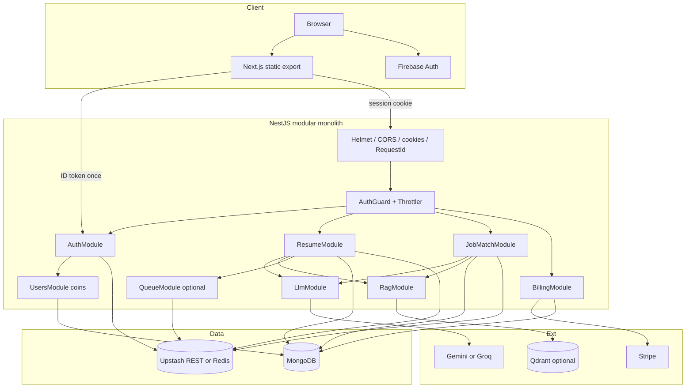
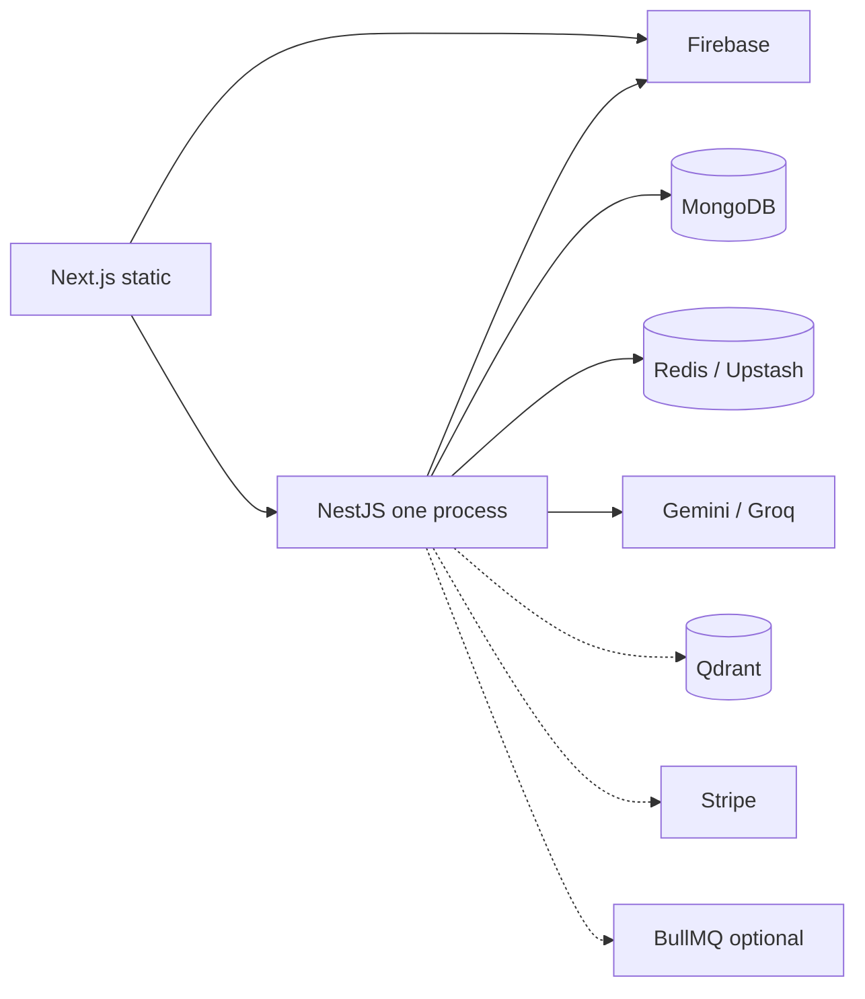
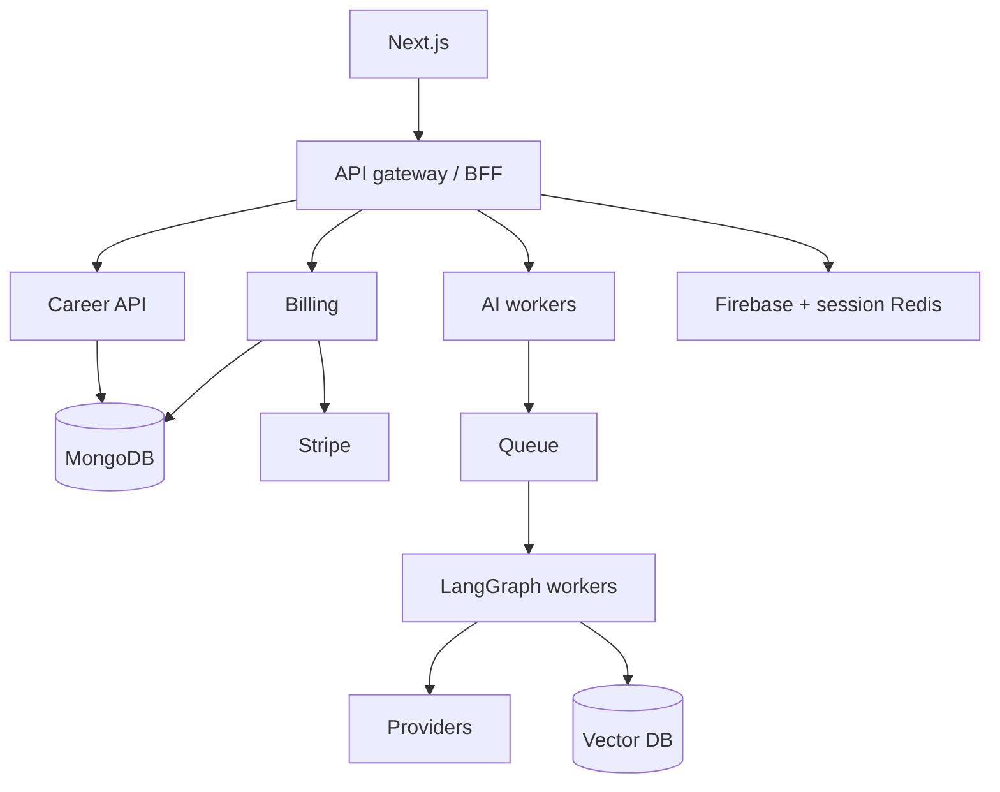

# AI Career Copilot — System Architecture

This document describes **the architecture that exists in this repository**. It is written for onboarding, system-design discussion, and Senior Full-Stack / Senior Node.js interviews.

**Status labels used throughout**

| Label | Meaning |
|-------|---------|
| **Implemented** | Code exists and is wired into the request path |
| **Optional / off by default** | Code exists; production or local env may disable it |
| **Partially implemented** | Real code path, but a given deploy may not have keys/infra |
| **Future / Planned** | Not in the codebase; called out so it is not confused with reality |
| **Inconsistency** | Docs, OpenAPI, or env defaults disagree with runtime behavior |

Related product notes: [README.md](../README.md), [PORTFOLIO.md](../PORTFOLIO.md), [SYSTEM_FLOW.md](../SYSTEM_FLOW.md). Those files are not a substitute for this architecture record.

**Do not assume:** PostgreSQL, OpenAI, Nest JWT strategy, microservices, Kubernetes, Stripe subscriptions, Next.js middleware, or a Next BFF. Those are **not** how this system is built.

---

# 1. Product Overview

**WHAT.** AICareerCopilot is a usage-metered SaaS for job seekers. A signed-in user can critique and rewrite a resume for ATS, then score that resume against a real job description and copy the output to apply themselves.

**WHO.** Individual candidates. There are **no orgs, roles, or admin APIs**. Every authenticated user has the same features; **coins** gate expensive AI runs.

**Main features (implemented)**

| Feature | What the user gets |
|---------|-------------------|
| Account | Google or email/password via Firebase; optional linking of both on the **same** UID |
| Dashboard | Coin balance and shortcuts |
| Resume analysis | PDF or paste → critique, ATS notes, strengths/gaps, rewrite, parsed profile |
| Job match | JD + resume → fit %, requirement evidence, gaps, suggestions |
| Billing | One-time **coin packs** via Stripe Checkout when keys exist |
| Contact / about | Static pages; contact is mailto |

**WHAT it is not.** There is **no interview-prep module**, LinkedIn import, or auto-apply. The field `interviewCoins` is the currency name, not an interview product.

**How AI is used.** The API never lets the browser call Gemini/Groq. Nest builds prompts, asks the model for **JSON matching a Zod schema**, then (for job match) **recomputes the headline percentage in TypeScript**. Optional RAG injects labor-market snippets; if RAG is off, analysis still runs with empty citations.

**How users are charged.** Not a monthly seat. New Mongo users get `USER_STARTING_COINS` (default **20**). A successful resume or job-match run costs `RESUME_COIN_COST` / `JOB_MATCH_COIN_COST` (default **10**). Failures cost **0**. Identical job-match hashes are **free**. Stripe credits pack sizes onto the same integer.

**External services (actually referenced in code)**

| Service | Role | Status |
|---------|------|--------|
| Firebase Auth + Admin | Credentials + ID-token verify | **Implemented** (required in production) |
| MongoDB Atlas | Users, analyses, matches, billing ledger | **Implemented** (required in production) |
| Upstash Redis REST and/or Redis protocol | Sessions, cache, optional BullMQ | **Implemented** (prod requires REST or `REDIS_URL`) |
| Google Gemini / Groq | Chat LLM | **Implemented** (env switch; mock in tests) |
| Qdrant | Vector RAG | **Implemented**, **optional**; Render blueprint sets `RAG_ENABLED=false` |
| Stripe | Checkout + webhooks | **Partially implemented** (code ready; `enabled` depends on keys) |
| Sentry | Error reporting | **Optional** (DSN) |
| Vercel / Render | UI / API hosting | **Implemented** |

```text
User
  ↓
Next.js static UI  ←→  Firebase Auth (ID token at login only)
  ↓  HTTP-only session_id cookie
NestJS API (one process)
  ├── Authentication (Firebase Admin + Redis session)
  ├── Career features (resume, job-match)
  ├── AI (LangGraph + LlmService → Gemini | Groq | mock)
  ├── RAG (Qdrant, optional)
  ├── Billing (Stripe Checkout packs, not subscriptions)
  └── Usage (interviewCoins on Mongo user)
  ↓
MongoDB  |  Redis/Upstash  |  LLM  |  Qdrant  |  Stripe
```

**WHY this product shape.** Candidates already have ChatGPT. The differentiator is **role-specific output tied to their document**, a **defensible match %**, and **SaaS metering** so it looks like a product, not a notebook.

---

# 2. Complete Technology Stack

| Layer | Technology | Actual usage | Why (problem it solves) |
|-------|------------|--------------|-------------------------|
| Frontend | Next.js 16 App Router, React 19, Tailwind 4, `output: "export"` | Static SPA on Vercel (or nginx Docker) | Ship a cheap UI without a Node server for HTML; API stays independent |
| Frontend tests | Vitest + Testing Library | Component tests | Catch auth/API client regressions without a browser farm |
| Backend | NestJS 11, Express, TypeScript | Single HTTP API | Modules, DI, guards, pipes — structure for a growing SaaS, not a 200-line Express file |
| Backend tests | Jest unit + e2e | `*.spec.ts`, `test/` | Run CI without live Gemini/Mongo |
| Database | MongoDB + Mongoose | `users`, `resumes`, `job_matches`, `billing_events` | Nested AI JSON; optional memory stores when URI unset (**not** for production) |
| Cache / sessions | Upstash Redis REST **or** ioredis **or** in-memory | Sessions, analysis cache, idempotency keys | Fast lookup; revocable sessions; **not** the system of record |
| Authentication | Firebase client + `firebase-admin` | Google + email/password; Nest never stores passwords | OAuth/password UX without building an IdP |
| Session | Opaque `session_id` cookie → Redis | 7-day TTL (default), slid on `/auth/me` | XSS-resistant vs localStorage JWT; logout = delete key |
| AI orchestration | `@langchain/langgraph` | Resume pipeline only | Multi-step analyze with validation retry |
| AI chat | LangChain Gemini / Groq | `LlmService.generateStructured` | Vendor switch + structured JSON |
| AI test double | `MockLlmProvider` | `LLM_PROVIDER=mock` | Zero-cost CI and local |
| RAG | Qdrant + Gemini or mock embeddings | Inject market snippets | Grounding **without** inventing citations when empty |
| Billing | Stripe Checkout `mode: 'payment'` | Coin packs + webhook | PCI offloaded; **not** Subscriptions |
| Queue | BullMQ | Resume analysis only | HTTP 202 + poll when LLM is slow; **off by default** |
| Security | Helmet, CORS allowlist, ValidationPipe, Throttler | API hardening | Credentialed cookies cannot use `*` origin |
| Observability | Request IDs, JSON logs, optional Sentry | HTTP + 5xx | Debug a Vercel→Render hop |
| Deploy | Vercel, Render Docker, GitHub Actions | Split hosting | Cheap UI + Docker API |
| Local infra | Compose: Mongo, Redis, Qdrant | `docker-compose.yml` | Full stack without cloud |

**Not in the stack:** OpenAI SDK, PostgreSQL/Prisma, Nest JWT module, Kafka, K8s manifests, Next `middleware.ts`, Redux/Zustand.

---

# 3. Architecture Style

### What it is

A **layered modular monolith**:

- Two **deployables** in one git repo (static Next.js + Nest API).
- One Nest **process**, many **modules** (`Auth`, `Users`, `Resume`, `JobMatch`, `Llm`, `Rag`, `Billing`, `Cache`, `Health`, optional `Queue`).
- Inside a feature: **controller → guard/pipe → service → store interface → Mongo/Redis/LLM**.
- Resume adds a **LangGraph state machine** (not a second microservice).
- **Not** microservices, **not** event-driven (except optional BullMQ), **not** serverless functions for the API.

Proven by `backend/src/app.module.ts` importing feature modules into a single `AppModule`.

### Why it was chosen

A small team needed auth, metering, two AI products, and payments **in one coherent loop**. Module boundaries give later split points without paying distributed-systems tax on day one.

### Why it fits this product

The user’s journey is one session: sign in → analyze resume → match a JD → maybe buy coins. Those steps share **the same user document and coin balance**. Splitting “career” and “billing” into separate services would add network hops and dual-writes for a product whose bottleneck is **LLM latency**, not Nest CPU.

### Why alternatives were not selected

| Alternative | Why not (now) |
|-------------|----------------|
| Microservices | Extra deploy, auth propagation, tracing, and failure modes; team of one cannot operate that |
| Next.js full-stack (Route Handlers + secrets) | Secrets and long LLM calls belong on Render with a real Node process; static export is cheaper |
| Pure Express mega-file | Guards, throttling, Swagger, and module tests get messy quickly |
| Serverless per-request Lambda | 30s+ LLM calls, cold starts, and cookie sessions fight typical serverless limits |

### Why modular monolith instead of microservices?

**Team size.** One (or few) engineers own the whole request. Microservices need contracts, versioning, and on-call per service.

**Development speed.** Change coin cost, prompt, and UI in one PR; run `npm run dev`.

**Operational complexity.** Production is one API container. Redis, Mongo, Firebase, Stripe are **managed** dependencies, not eight of our services.

**Deployment.** Render one Docker image. A second AI worker is a **flag** (`RESUME_QUEUE_ENABLED`), not a new repo.

**Debugging.** One request id through logs. No “which service dropped the span?”

**AI latency.** Adding an HTTP hop from Career Service → AI Service would **increase** p95. The first scale lever is a **queue in the same codebase**, already written.

**Cost.** Free/cheap Render dyno + Vercel static. Microservices multiply idle compute.

**Scaling requirements.** Hundreds-to-low-thousands of users: Atlas + Upstash + provider rate limits dominate. When **AI worker CPU/time** or **team ownership** actually diverges, extract workers — not a fashion-driven split.

---

# 4. High-Level System Architecture



**Plain English**

- The **browser** signs into Firebase, then exchanges an ID token for a Nest session cookie.
- **Nest** is the only place that talks to Mongo, Redis, LLMs, Qdrant, and Stripe secrets.
- **Feature modules** do not call Stripe from the resume controller or Gemini from `AuthController`.
- **Stores** are interfaces so tests can run with memory implementations.
- **Queue** is the same resume `execute()` method, delayed; not a different product.

---

# 5. Frontend Architecture

**WHAT.** App Router pages under `frontend/src/app/`, **static export** (`frontend/next.config.ts`). Almost all interactive pages are client components. There is **no** `middleware.ts` and **no** Next Route Handler BFF.

```text
Browser
  ↓
React / Next.js page
  ↓
AuthProvider (React Context) + RequireAuth
  ↓
api.ts (typed fetch, credentials: include)
  ↓
Nest /api/v1
```

### Routes

| Path | File | Responsibility |
|------|------|----------------|
| `/` | `frontend/src/app/page.tsx` | Marketing |
| `/login` | `frontend/src/app/login/page.tsx` | Sign-in / register |
| `/dashboard` | `frontend/src/app/dashboard/page.tsx` | Coins, navigation |
| `/resume` | `frontend/src/app/resume/page.tsx` | Analysis UI |
| `/job-match` | `frontend/src/app/job-match/page.tsx` | Match UI |
| `/billing` | `frontend/src/app/billing/page.tsx` | Packs / Checkout redirect |
| `/billing/success` | `frontend/src/app/billing/success/page.tsx` | Return UX **only** (does not credit coins) |
| `/about`, `/contact` | matching files | Static / mailto |

`frontend/src/app/layout.tsx` wraps every page with `AuthProvider`, `SentryInit`, `Navbar`, `Footer`.

### Authentication state — `frontend/src/lib/auth-context.tsx`

**WHAT.** Holds the **API user** (`GET /auth/me` / login response), not Firebase `currentUser` as source of truth.

**WHY here.** Pages must not invent `userId`. Firebase is only the credential mint. Context also handles silent re-exchange if Firebase still has a user but the cookie is gone, session-expired events, and **dev-only** `localStorage` uid for `x-user-id` (never in production builds).

### API client — `frontend/src/lib/api.ts`

**WHAT.** Unwraps `{ success, data, meta }` / `{ success: false, error }` into typed values or `ApiError`. Always `credentials: "include"`. Resume analyze/upload: if the body looks like `{ jobId, status }` (202 queue), **poll** `GET /resume/status/:jobId` until completed/failed/timeout (180s).

**WHY here.** Envelope parsing, 401 → `onSessionExpired`, and queue polling would be copy-pasted in every page. The client is the single HTTP policy layer. It does **not** contain prompts or scoring — those belong on the server.

### `frontend/src/lib/api-base-url.ts`

**WHAT.** Ensures `NEXT_PUBLIC_API_URL` ends at `/api/v1` even if Vercel only has the Render host.

**WHY.** A missing prefix would POST `/auth/login` on the API root and fail in production only.

### Firebase — `frontend/src/lib/firebase.ts`

**WHAT.** Public config, Google popup, email register/login, link providers, password reset, verification.

**WHY.** Nest must never see passwords. Linking is **same UID**; emails are not auto-merged (`auth-providers.ts`).

### Route protection — `frontend/src/components/RequireAuth.tsx`

**WHAT.** Skeleton while `/auth/me` loads; in-place sign-in if logged out; **does not mount** children until authenticated (no flash of paid UI).

**WHY.** Static export cannot do server redirects. In-place gate avoids redirect loops.

### State management

**Implemented:** React Context + `useState`. **Not implemented:** Redux, Zustand, React Query.

**WHY.** The product has few shared entities (user + current analysis). Extra client cache would duplicate Redis/Mongo.

### Client vs server

Static export = **no server components calling Nest**. Metadata is static. Secrets stay in the API env.

### Environment

`NEXT_PUBLIC_*` is **baked in at build time** (Vercel and `frontend/Dockerfile` ARGs). Changing the API URL requires a **rebuild**.

### Errors and loading

`ApiError` flags (`isValidation`, `isRateLimit`, `isUpstream`). Pages hold `error` / busy flags. `AuthLoading` skeleton. Resume poll reports `step` / `percent` when queued.

---

# 6. Backend Architecture

```text
HTTP
  → Helmet, compression, cookie-parser, CORS, rawBody (Stripe)
  → RequestIdMiddleware
  → prefix `api` + URI version `v1`
  → ThrottlerGuard (global)
  → ValidationPipe (whitelist, 422)
  → Controller
  → AuthGuard (when declared)
  → Service
  → Store / LlmService / Stripe / RagService
  → ResponseInterceptor  or  AllExceptionsFilter
```

`backend/src/main.ts` and `backend/src/app.module.ts`.

### Why each layer is separate

| Layer | Files | Why separate? |
|-------|-------|----------------|
| **Middleware** | `request-id.middleware.ts` | Correlation id before guards; Stripe needs raw body at the framework level (`rawBody: true`), not in a controller |
| **Guards** | `auth.guard.ts`, Throttler | Auth is a **policy**, not a line in every handler. Forgetting it should be obvious (`@UseGuards`) |
| **Pipes** | global `ValidationPipe` + DTOs | Reject bad input **before** LLM spend |
| **Controllers** | `*.controller.ts` | HTTP mapping only: status 200 vs 202, multipart, Swagger |
| **Services** | `*.service.ts` | Orchestration, coins, “when to call the graph” |
| **Stores** | `mongo-*.ts`, `memory-*.ts` | Persistence swap for tests; no Mongoose in controllers |
| **LLM / RAG modules** | `llm/`, `rag/` | Vendor and retrieval changes without rewriting resume HTTP |
| **Interceptors** | response + logging | One envelope; one HTTP log format |
| **Filters** | `all-exceptions.filter.ts` | Clients never see raw stacks in production |
| **Modules + DI** | `*.module.ts` | Explicit graph; token injection (`LLM_PROVIDER`, `USERS_STORE`) |

**DTOs vs Zod.** HTTP bodies use `class-validator` DTOs. LLM JSON uses **Zod** (`resume.schema.ts`, `job-match.schema.ts`). **WHY:** HTTP validation is “is this request legal?” LLM validation is “did the model honor the contract?” Mixing them would couple OpenAPI to prompt schemas.

**Inconsistency:** Swagger `.addBearerAuth()` in `main.ts` documents Bearer tokens; **`AuthGuard` does not read `Authorization`**. Runtime auth is the cookie (or forbidden-in-prod `x-user-id`).

There is **no RBAC** layer. Authorization is “authenticated user may only read/write **their** rows” (`userId` from session).

---

# 7. Authentication Architecture

```text
User
  ↓
Firebase (Google or email/password) — browser only
  ↓
ID token
  ↓
POST /api/v1/auth/login { idToken }     AuthController.login
  ↓
FirebaseAdminService.verifyIdToken      identity from token, never from body uid
  ↓
UsersService.findOrCreate               Mongo by firebaseUid; coins only on insert
  ↓
SessionService.createSession            32-byte random id, Redis session:{id}
  ↓
Set-Cookie: session_id  (HttpOnly, SameSite from env, Secure when needed)
  ↓
Later requests: cookie only
  ↓
AuthGuard → SessionService.getSession
  ↓
req.userId = firebaseUid
  ↓
@CurrentUser()
```

**Registration:** there is **no** Nest `/register`. `createUserWithEmailAndPassword` lives in `auth-context.tsx`. First token exchange **inserts** Mongo with starting coins; later logins **load** (`mongo-users.store.ts`).

**Logout:** delete Redis key + clear cookie (`AuthService.logout`).

**`GET /auth/me`:** load Mongo user, **slide session TTL** so active users are not kicked mid-week.

**Dev bypass:** `AUTH_DEV_BYPASS` + no Firebase Admin + non-production → `x-user-id`. **Refused in production** and whenever Admin is configured (`auth.guard.ts`).

### Why this authentication approach?

**Problem.** Split Vercel/Render origins, Google sign-in, and a SPA that must not put a session secret in `localStorage`.

**Why Firebase + Nest session.** Firebase owns credential UX (reset, verification, Google). Nest owns **tenancy and coins**. The ID token is a **one-shot ticket**; the cookie is the **API session**.

**Compared to alternatives**

| Approach | Why not as the only mechanism |
|----------|-------------------------------|
| JWT in `localStorage` | XSS can steal it; logout is “wait for expiry”; we already have XSS surface in a SPA |
| Nest access + refresh JWTs | We would rebuild Google/password; refresh rotation is extra state we already get from Redis TTL |
| Auth.js on Next | Static export has no Node session store; secrets would leak toward the UI deploy |
| Custom password hashes in Mongo | Worse security than Firebase; we would own reset emails |

**Trade-offs.** Two vendors (Firebase + Redis). Cross-site cookies need `SameSite=None; Secure` and an **exact** CORS origin. **CSRF tokens are not implemented**; SameSite + CORS allowlist are the controls. Session is opaque — a leaked cookie is still a stolen session until TTL or logout (mitigate with short TTL / future binding — **not implemented**).

---

# 8. Resume Analysis Architecture

```text
Upload PDF or paste text
  ↓
AuthGuard (firebaseUid from session)
  ↓
ensureUser + assertSufficientCoins          // 402; no LLM yet
  ↓
Idempotency cache resume:idem:{uid}:{requestId}
  ↓
Inline execute  OR  BullMQ enqueue (202)
  ↓
LangGraph:
  extractText → normalizeText
       ↓ (error → fail)
  retrieveContext (RAG; never fails the graph)
       ↓
  analyzeResume (LLM structured)
       ↓
  validateOutput (Zod)
       ↓ retry analyze  or  ats  or  fail
  atsEvaluation → generateRecommendations
  ↓
Charge coins (atomic)
  ↓
Mongo upsert latest analysis
  ↓ (persist fail → refund)
Redis cache resume:analysis:{uid}
  ↓
Return analysis + remaining coins
```

**Code map**

- HTTP: `backend/src/resume/resume.controller.ts`
- Façade: `resume.service.ts` (`GET /me` cache-then-store)
- Orchestration: `resume-analysis.service.ts` (`submit` / `execute`)
- Graph: `backend/src/ai/langgraph/resume/graph.ts`
- State: `backend/src/ai/langgraph/resume/state.ts`

### Why LangGraph?

Resume is **not** one question. PDF extract can fail; JSON can be invalid; ATS should not be “whatever the model typed.” A graph makes **retry and degrade** explicit. Persistence stays **outside** the graph (comment on `state.ts`) so the worker and HTTP path share `execute()`.

### Nodes (actual)

| Node | File | Job |
|------|------|-----|
| `extractText` | `nodes/extract-text.node.ts` | PDF path or raw text |
| `normalizeText` | `nodes/normalize-text.node.ts` | Clean / length; can set `error` |
| `retrieveContext` | `nodes/retrieve-context.node.ts` | RAG **after** text exists (PDF-safe); **never** sets `error` |
| `analyzeResume` | `nodes/analyze-resume.node.ts` | LLM + Zod-shaped resume |
| `validateOutput` | `nodes/validate-output.node.ts` | Zod + extra checks; increments `retryCount` |
| `atsEvaluation` | `nodes/ats-evaluation.node.ts` | Hybrid ATS |
| `generateRecommendations` | `nodes/recommendations.node.ts` | Final recs |
| `fail` | in `graph.ts` | Terminal error |

### State

`userId`, `requestId`, `filePath` / `rawText`, `normalizedText`, `role`, RAG fields, `resume`, `validationErrors`, `retryCount`, ATS/recs, `error`. Reducers replace arrays rather than concatenate so retries do not duplicate evidence.

### Conditional edges

- After **normalize**: `error` → `fail`, else `retrieveContext`.
- After **validate**: `routeAfterValidation` → `atsEvaluation` | `analyzeResume` | `fail`.
- Retry if `retryCount <= RESUME_ANALYSIS_MAX_RETRIES` (default **2**).

### Why not one large LLM prompt?

One prompt mixes extract, critique, ATS, and market facts. Invalid JSON would fail the **entire** product. A polished resume could still get a vanity ATS score. Graph: fail extract without calling the LLM; retry **only** analyze; ATS/recommendations can use structured state. **Job match** is a different pipeline (see §11) because the headline number must be **code**.

PDF extract without analysis: `POST /resume/extract` — **no coins** (`extractUpload`).

---

# 9. AI Architecture

```text
ResumeAnalysisService / JobMatchService
  ↓
LlmService.generateStructured
  ↓
LLM_PROVIDER token
  ├── GeminiProvider    ChatGoogleGenerativeAI
  ├── GroqLangChainProvider  ChatGroq
  └── MockLlmProvider
  ↓
BaseLangChainProvider
  ├── withStructuredOutput + Zod
  └── fallback: invoke + JSON parse + Zod
```

**Files:** `backend/src/llm/llm.module.ts`, `llm.service.ts`, `llm.interface.ts`, `providers/base-langchain.provider.ts`, `gemini.provider.ts`, `groq.provider.ts`, `mock.provider.ts`.

### Why is AI logic not inside controllers?

Controllers handle multipart, 202 vs 200, and Swagger. Putting Gemini there would make HTTP tests require API keys and make queue workers duplicate HTTP. **WHY:** testability, one `execute()` for sync and async, and a place to add metrics later (`LlmService` is intentionally a thin façade).

### Why provider abstraction?

**Problem:** Groq vs Gemini price/availability; CI must not call paid APIs.

**WHY:** `LLM_PROVIDER` env switch. Missing keys fall back to **mock** at module init (logged). Production **forbids** mock unless `ALLOW_MOCK_LLM=true` (`env.validation.ts`).

**OpenAI is not implemented.**

### Why structured output?

Resume/match UIs need arrays and scores, not markdown essays. Native `withStructuredOutput` is preferred; if the vendor rejects the schema, parse JSON instead (`base-langchain.provider.ts`). Rate limits/auth/timeouts are **not** retried as a second provider call (`maxRetries: 0` on Gemini).

### Why Zod?

JSON Schema from the model is still untrusted. Zod is the **contract** shared with persistence (`ResumeAnalysisSchema.safeParse` again after the graph). Fail **closed** (503), not a half-filled UI.

### Invalid JSON

Provider: `LlmInvalidOutputError` → 503 `STRUCTURED_OUTPUT_INVALID`. Graph: increment `retryCount`, re-enter `analyzeResume`; after max retries → `MAX_RETRIES_EXCEEDED`.

### Provider failure

`LlmUpstreamError` → 503, user-safe message (`llm-upstream.user-message.ts`).

### Timeout

`LLM_TIMEOUT_MS` (default 30s) → `LlmTimeoutError` → 503 `LLM_TIMEOUT`.

### Why mock?

Deterministic tests, local demo, staging with `ALLOW_MOCK_LLM`. Mock can **hide** real RAG lists; `merge-mock-rag.ts` prefers real retrieval when both exist.

---

# 10. RAG Architecture (how it is actually implemented)

This is **Retrieve-Augmented Generation over a public labor-market corpus**, not “the user’s resume stored in a vector DB.” The corpus is skill/role snippets with sources. The user’s resume is the **query**, not the indexed document.

**Status (do not mix these up in an interview)**

| Fact | Status |
|------|--------|
| RAG code (ingest, embed, Qdrant, retrieve, prompt inject) | **Implemented** |
| Wired into resume LangGraph and job-match | **Implemented** |
| Enabled on Render production (`render.yaml` `RAG_ENABLED=false`) | **Optional / off** |
| Env schema default `RAG_ENABLED=true` | **Inconsistency** vs Render |
| Per-user resume vectors / memory RAG | **Not implemented** |
| LangChain retrievers / LangGraph RAG agent tools | **Not used** — custom Nest services |

If Qdrant is off or empty, **critique / ATS / match still run**. Market fields come back **empty**. We do not invent citations.

---

## 10.1 What problem RAG solves

A Gemini/Groq model’s training data is **stale** for “what employers expect for this role.” If we let the model invent “the market,” we get fake URLs and generic advice. RAG retrieves **short, sourced skill expectations** and puts them in the prompt as *external reference*, never as proof the candidate has that skill.

**WHY not skip RAG entirely?** The product still works without it (degrade empty). RAG is a **quality layer**, not a hard dependency — which is why production can ship with it off.

Interview script (RAG vs plain LLM, request flow, deterministic scoring): **§25.4**.

---

## 10.2 Two phases: ingest vs query

```text
INGEST (offline, npm run rag:ingest)
  Seed TypeScript records
       ↓
  RagIngestionService.normalizeRecords
       ↓
  EmbeddingService.embedText(role + skill + evidence)
       ↓
  Qdrant upsert  (cosine, dim = embedding provider)
       ↓
  Write corpus_meta point  (which provider + dimensions)

QUERY (every resume analyze / job-match miss)
  Resume text (+ optional role) and/or JD
       ↓
  Same EmbeddingService.embedText(query)
       ↓
  Qdrant search top 8
       ↓
  RagService builds promptContext + marketSignals + priorityGaps + citations
       ↓
  Injected into LLM user prompt
       ↓
  LLM JSON  →  UI fields (and job-match TypeScript scoring still owns %)
```

Ingest is **not** on the request path. It is a Nest application-context script: `backend/src/rag/scripts/ingest-public-datasets.ts` (`backend` package script `rag:ingest`).

---

## 10.3 Corpus (what is indexed)

**Files:** `backend/src/rag/data/public-role-skills.seed.ts`, `comparison-corpus.seed.ts`, `adjacent-roles.seed.ts`.

Each record (`PublicSkillRecord` in `rag.types.ts`):

- `id`, `role`, `skill`, `importance` (`core` | `important` | `emerging`)
- `evidence` (one-sentence labor-market claim)
- `sourceName`, `sourceUrl` (e.g. O*NET / ESCO crosswalk URLs)
- optional `seniority`

`RagIngestionService` concatenates `role + skill + evidence`, embeds that string, and stores payload metadata on the Qdrant point so retrieval can show **skill, role, evidence, citation** without a second database.

This is a **small curated seed**, not a live job-board crawl. **Future:** larger datasets; the ingest service already concatenates multiple seed arrays.

---

## 10.4 Embedding layer

**Interface:** `EmbeddingProvider` (`embeddings/embedding.interface.ts`) — `name`, `dimensions`, `embedText`.

**Façade:** `EmbeddingService` — features never import Gemini REST.

| `RAG_EMBEDDING_PROVIDER` | Class | Why |
|--------------------------|-------|-----|
| `mock` (schema default) | `MockEmbeddingProvider` | Deterministic hash-based unit vectors so local Qdrant works **without** an API key |
| `gemini` | `GeminiEmbeddingProvider` | Real embeddings via Gemini `embedContent`; **must** set `outputDimensionality` (default 768) because native Gemini width (e.g. 3072) would not match a 768 collection |
| RAG off | `NoopEmbeddingProvider` | Empty vectors |

**Critical rule (implemented):** ingest and query **must use the same provider and dimension**. Mismatched spaces still return “nearest neighbors” — they are just **unrelated**. `RagService.onModuleInit` and `hasProviderMismatch` treat that as **no evidence**, not as citations.

Gemini embeddings are **independent** of `LLM_PROVIDER`. You can chat with Groq and embed with Gemini, or use mock embeddings with a real LLM.

---

## 10.5 Vector store (Qdrant)

**Interface:** `VectorStore` (`vector/vector-store.interface.ts`).

| Implementation | When |
|----------------|------|
| `QdrantVectorStore` | `RAG_ENABLED` and `QDRANT_URL` set |
| `NoopVectorStore` | otherwise |

**Collection:** `QDRANT_COLLECTION` default `career_copilot_skills`. Distance: **Cosine**. Point ids are UUID-shaped hashes of the seed `id` (`toPointId` in `qdrant-vector.store.ts`).

**Corpus metadata:** a reserved point (`kind: corpus_meta`) stores `embeddingProvider` + `dimensions`. Search **filters it out** so it is never returned as a skill hit. Qdrant Cloud may require a payload index on `kind`; the store creates it and retries without the filter if needed.

Local: `docker-compose.yml` service `qdrant`. Cloud: `QDRANT_API_KEY`. 401/403 → empty context, not a crashed API.

---

## 10.6 Retrieval (`RagService`)

**File:** `backend/src/rag/rag.service.ts`

**Boot (`onModuleInit`):** if disabled, noop store, missing collection, dimension mismatch, provider mismatch, or Qdrant unauthorized → set `disabledReason` and **never throw**. Empty collection: warn, still allow queries (they will miss).

**Resume query:** `buildResumeContext({ role, resume })` — query text is optional role + **first 2,000 chars** of resume.

**Job-match query:** `buildJobMatchContext` — role + **full JD** + first **1,500 chars** of resume.

**Then:** embed → `store.search(vector, 8)` → if no hits or provider mismatch → `emptyContext()`.

**Shaping hits into context:**

| Field | How it is built |
|-------|-----------------|
| `promptContext` | Header `RAG EVIDENCE: ...` plus lines `- {role} / {skill} ({importance}): {evidence} [{sourceName}]` |
| `marketSignals` | Top 6 hits as `"{skill} is expected for {role}: {evidence}"` |
| `priorityGaps` | Hits with `importance === 'core'`, skill names, max 6 |
| `citations` | Unique `sourceName (sourceUrl)`, max 4 |

Any retrieval exception: log, return empty arrays. **Product stays up.**

---

## 10.7 Where RAG joins the product

### Resume (LangGraph)

Graph order (`graph.ts`): extract → **normalize** → **`retrieveContext`** → analyze → validate → ATS → recs.

**WHY after normalize?** PDF uploads have no text until extract/normalize. Querying Qdrant with only a target role would miss resume-specific skills.

**Node:** `nodes/retrieve-context.node.ts` — calls `RagService.buildResumeContext`, writes `ragContext` / `ragMarketSignals` / `ragPriorityGaps` / `ragCitations` onto graph state. **Never sets `error`.**

**Prompt:** `prompts/resume.prompt.ts` `buildResumeAnalysisUserPrompt` appends `ragContext` if present.

**After the graph:** `ResumeAnalysisService.execute` runs `mergeMockWithRagFields` so a **mock LLM** cannot overwrite real retrieval with heuristic fake citations (`rag/merge-mock-rag.ts`).

### Job match (service, not graph)

`JobMatchService.runScore` → `rag.buildJobMatchContext` → `buildJobMatchUserPrompt` section `EXTERNAL REFERENCE CONTEXT`.

System prompt (`job-match.prompt.ts`) is explicit: market notes are **not** candidate evidence; do not mark a requirement `matched` only because it appeared in RAG. `finalizeMatchResult` still **overwrites the % in TypeScript** and prefers RAG citations/signals via `applyMarketFromRag` when present.

---

## 10.8 Fail-closed vs fail-open (interview distinction)

| Layer | Policy |
|-------|--------|
| LLM JSON | **Fail closed** — invalid shape → retry / 503, no fake analysis |
| RAG | **Fail open (empty)** — no Qdrant → empty citations, analysis continues |
| Job-match score | **Fail closed on vanity %** — code owns the number even if RAG is empty |

**WHY:** A missing vector DB should not take down resume critique. A hallucinated citation **would** take down trust. Empty is better than invented.

---

## 10.9 What RAG is not (say this out loud)

- Not LangChain `VectorStoreRetriever` / not a LangGraph tool-calling agent.
- Not MongoDB Atlas Vector Search (vectors live in **Qdrant**).
- Not embeddings of each user’s stored resume for “similar candidates.”
- Not the ATS score or job-match percentage.
- Not automatically ingested in CI or on Render boot.

**Future / Planned:** production ingest + `RAG_ENABLED=true` after the collection exists; optional second collection for **user** documents. Interfaces (`VectorStore`, `EmbeddingProvider`) already allow that without rewriting controllers.

---

## 10.10 File map

| Concern | Path |
|---------|------|
| Module / DI | `backend/src/rag/rag.module.ts` |
| Retrieve + boot checks | `backend/src/rag/rag.service.ts` |
| Types | `backend/src/rag/rag.types.ts` |
| Ingest | `backend/src/rag/ingestion/rag-ingestion.service.ts` |
| CLI ingest | `backend/src/rag/scripts/ingest-public-datasets.ts` |
| Qdrant | `backend/src/rag/vector/qdrant-vector.store.ts` |
| Seeds | `backend/src/rag/data/*.seed.ts` |
| Resume node | `backend/src/ai/langgraph/resume/nodes/retrieve-context.node.ts` |
| Resume prompt | `backend/src/ai/langgraph/resume/prompts/resume.prompt.ts` |
| Job-match prompt | `backend/src/job-match/job-match.prompt.ts` |
| Mock vs real fields | `backend/src/rag/merge-mock-rag.ts` |

---

# 11. Job Matching Architecture

Job match is **not** LangGraph. It is always **inline** (no BullMQ).

```text
POST /job-match/score  { jobDescription, resume }
  ↓
AuthGuard
  ↓
content hash (JD + resume)
  ↓
Redis hash cache or Mongo unique (userId, contentHash)
  ├── hit → persist inputs if needed, 0 coins, cached: true
  └── miss
        ↓
        assertSufficientCoins
        ↓
        RAG context (optional)
        ↓
        LlmService.generateStructured (MatchResultSchema)
        ↓
        finalizeMatchResult  (job-match.score.ts)
        ↓
        chargeJobMatch
        ↓
        upsert job_matches
        ↓ (persist fail → refund)
        cache hash + last match
```

**Files:** `job-match.controller.ts`, `job-match.service.ts`, `job-match.prompt.ts`, `job-match.score.ts`, `content-hash.ts`.

### Why doesn't the LLM decide the final percentage?

Models reward fluent language. A React resume against an Angular JD can still look “strong.” **WHY hybrid:** the model extracts **requirements + evidence + status**; TypeScript applies weights (`required` 35, experience 20, etc.), stack coverage, and a **mismatch cap (52)** on stack/framework conflict (`MISMATCH_CAP` in `job-match.score.ts`). `finalizeMatchResult` overwrites `score` and derives gaps/strengths from evidence when present.

**Trust:** the candidate can defend “72% because these required bullets are missing,” not “the AI felt like 90.”

---

# 12. Coin / Usage Metering

```text
Request
  ↓
assertSufficientCoins          // read balance; 402 if low
  ↓
AI execution
  ↓
Success?
  ├── No  → no charge
  └── Yes → chargeCoins  findOneAndUpdate { firebaseUid, interviewCoins: { $gte: cost } }, $inc: -cost
        ↓
        Persist
        ├── OK → cache, return coins remaining
        └── Fail → refundCoins ($inc +amount)
```

**Storage:** `users.interviewCoins` (Mongo). Costs from env (`UsersService`).

**WHY coins.** LLM calls cost money; a free public demo would be abused. A simple integer is enough for an MVP without Stripe metered billing.

**Atomic charge.** The `$gte` predicate is the **real** lock. Two concurrent charges cannot both decrement below zero.

**Duplicates**

- Resume: Redis `resume:idem:{userId}:{requestId}` (1 hour) returns prior result; queue job id `${userId}__${requestId}`.
- Job match: same content hash → **0 coins**.
- Stripe: unique event/session ids (§13).

**Refunds.** If Mongo persist fails after charge, refund is best-effort; if refund also fails it is **logged for manual reconcile** (`resume_charge_refund_failed`).

**Known race / cost issue.** Pre-check is **not** a reservation. Two parallel analyses can both pass `assertSufficientCoins`, both call the LLM, then the second **charge** returns 402. **Impact:** unpaid provider cost. **Fix when:** hold/capture coins or a per-user mutex. **When:** if concurrent runs become common — **not implemented**.

Extract PDF and cache-hit job match: **no charge**.

---

# 13. Stripe Architecture

**Actual model: one-time payments (coin packs).** `mode: 'payment'` in `billing.service.ts`. **Not** subscriptions. No Customer portal, no `customer.subscription.*` handlers.

```text
User (session)
  ↓
GET /billing/packs     public; enabled = secret + live price_ ids
  ↓
POST /billing/checkout { packId }
  ↓
Stripe Checkout (client_reference_id + metadata: firebaseUid, coins, packId)
  ↓
Payment
  ↓
POST /billing/webhook  SkipThrottle, raw body
  ↓
constructEvent(signature, STRIPE_WEBHOOK_SECRET)
  ↓
checkout.session.completed only
  ↓
ledger.recordIfNew (unique stripeEventId + stripeSessionId)
  ↓
users.creditCoins
  ↓
If credit throws → ledger.forget(session.id) so Stripe retry can apply
```

Packs: Starter 50 / Plus 200 / Pro 500 (`coin-packs.ts`). Live IDs from `STRIPE_COIN_PACKS`.

### Why webhook?

The success page is **unauthenticated proof of nothing**. Anyone can open `/billing/success`.

### Why not trust the frontend?

The browser is not a payment oracle. Coins move only after Stripe signs the event.

### Duplicate delivery

`MongoBillingLedger.recordIfNew`: duplicate key → skip credit. **Implemented.**

### If coin credit fails

Delete the ledger row for that session so a retry is not stuck as “already processed.” **Implemented.**

**Partial:** without keys, UI shows packs with `enabled: false`; product still runs on signup grant. Production validation: secret key requires webhook secret and pack string.

---

# 14. Database Architecture

**Technology:** MongoDB (Mongoose). **Not** PostgreSQL.

**WHY documents.** Resume analysis and match results are nested JSON (lists of skills, requirements, citations). Schema evolves with prompts. No multi-row SQL transactions across “resume line items.” Atlas fits a Render Node API.

If `MONGODB_URI` is unset: in-memory stores (**not** production — boot fails without URI in prod).

```text
User (firebaseUid unique)
  ├── 0..1 Resume     userId unique → latest analysis only
  ├── 0..N JobMatch   unique (userId, contentHash)
  └── 0..N BillingEvent  unique stripeEventId, stripeSessionId
```

| Collection | Schema | Indexes / ops |
|------------|--------|----------------|
| `users` | `user.schema.ts` | unique `firebaseUid`; `email` indexed; **atomic** `$inc` coins |
| `resumes` | `resume-document.schema.ts` | unique `userId`; `findOneAndUpdate` upsert |
| `job_matches` | `job-match-document.schema.ts` | unique `{ userId, contentHash }`; `{ userId, createdAt: -1 }` |
| `billing_events` | `billing-event.schema.ts` | unique event + session ids |

**Important queries:** `findOne({ firebaseUid })`; `findOneAndUpdate` charge; `findByUserAndHash`; `listByUserId` limit 20.

**Identity note:** Redis session stores Mongo `_id` **and** `firebaseUid`. Feature rows and charges use **Firebase UID** (`AuthGuard` sets `req.userId` to `firebaseUid`).

---

# 15. Caching Architecture

`CacheService` (`cache.service.ts`): default TTL `REDIS_CACHE_TTL_SECONDS` (**86400s / 24h**) on `set()`. Custom TTL via `setWithTtl`.

| What | Key | TTL | Why |
|------|-----|-----|-----|
| Session | `session:{id}` | `SESSION_TTL_SECONDS` (default 7d) | Opaque login; slid on `/me` |
| Latest resume | `resume:analysis:{userId}` | 24h default | Avoid Mongo on `GET /resume/me` |
| Resume idempotency | `resume:idem:{userId}:{requestId}` | **1 hour** | Duplicate analyze/upload |
| Last job match | `job-match:last:{userId}` | 24h | `GET /job-match/me` fallback |
| Hash match | `job-match:hash:{userId}:{hash}` | 24h | Free repeat + skip LLM |

**Miss:** read Mongo (resume/match) or recompute (score). Cache set failures are **logged, not fatal**.

**If Redis unavailable:** production must have Upstash REST or `REDIS_URL` at boot. At runtime, `safeCacheGet` returns null and work continues (except **sessions**, which require Redis in prod). Memory cache is local-only / tests.

**WHY cache AI results.** LLM is slow and expensive. Job-match hash is a **product** feature (free repeat), not just an optimization. Sessions **must not** live only in API memory if you ever run two instances.

---

# 16. Queue / Background Processing

**Implemented:** BullMQ queue `resume-analysis`, `ResumeJobClient`, `ResumeAnalysisProcessor`, `GET /resume/status/:jobId`.

**When enabled:** `RESUME_QUEUE_ENABLED=true` **and** Redis **protocol** URL (`REDIS_URL` / `UPSTASH_REDIS_URL`). Upstash **REST** is not a BullMQ broker.

**Default:** **false** (inline 200). `render.yaml` keeps it false on a single free instance.

**Worker:** same process unless `RESUME_QUEUE_WORKER=false`.

```text
POST /resume/analyze
  ↓
submit() coin + idempotency checks
  ↓
enqueue → 202 { jobId, status }
  ↓
Processor → analysis.execute()   // same as inline
  ↓
Client polls GET /resume/status/:jobId
  ↓
404 if job.data.userId !== session user
```

Enqueue timeout 2.5s → 503 `QUEUE_UNAVAILABLE`. Job attempts: **1** (`UnrecoverableError`). Custom ids use `__` not `:` (BullMQ/Redis separator).

### Why optional?

A single Render dyno should not depend on protocol Redis + a worker. Inline LangGraph is the **production default**. Async matters when LLM p95 exceeds HTTP/proxy timeouts or blocks the event loop — **then** turn the queue on, same graph.

Job match has **no** queue (**not implemented**).

---

# 17. Error Handling

```text
Frontend fetch
  ↓
Network → ApiError NETWORK
  ↓
Envelope success:false or HTTP error
  ↓
401 (not /auth/*) → onSessionExpired
  ↓
AllExceptionsFilter
  ↓
{ success: false, error: { code, message, details? }, meta }
```

| Situation | Status / code | Behavior |
|-----------|---------------|----------|
| Validation (DTO/Zod request) | 422 `VALIDATION_ERROR` | Field details |
| No/expired session | 401 `UNAUTHORIZED` | UI sign-in |
| Low coins | 402 `INSUFFICIENT_COINS` | Message with balance/cost |
| File too large | 413 `FILE_TOO_LARGE` | Multer + filter |
| LLM timeout / bad JSON / upstream | 503 | No coin charge (if before charge) |
| Persist after charge | 503 `DATABASE_ERROR` | Refund attempted |
| Queue Redis down | 503 `QUEUE_UNAVAILABLE` | |
| Stripe bad signature | 400 `INVALID_SIGNATURE` | |
| Stripe not configured | 503 `BILLING_DISABLED` | |
| Rate limit | 429 `RATE_LIMITED` | Throttler |
| Unknown 500 | generic message in prod | Sentry if DSN |

**WHY envelopes.** The static UI cannot guess Nest exception shapes. `api.ts` is the only unwrap.

---

# 18. Security Architecture

| Concern | Status | Notes |
|---------|--------|--------|
| Authentication | **Implemented** | Firebase verify + Redis session |
| Authorization / RBAC | **Not implemented** | Same role for all users; row isolation by session UID |
| HTTP-only cookie | **Implemented** | `session.constants.ts` |
| CORS | **Implemented** | Allowlist; prod forbids `*` |
| CSRF tokens | **Not implemented** | SameSite + CORS; weaker with `SameSite=None` |
| XSS | **Partial** | React escaping; HttpOnly cookie; no CSP on API (Helmet CSP off) |
| Input validation | **Implemented** | ValidationPipe + DTOs + Zod LLM |
| Rate limiting | **Implemented** | In-process Throttler; **not** Redis-shared |
| Stripe webhook signature | **Implemented** | raw body + secret |
| Secrets | **Implemented** | Env; `NEXT_PUBLIC_*` is public by design |
| PDF limits | **Implemented** | Size + type filter |
| User isolation | **Implemented** | Session UID; queue status tenancy; no body `userId` |
| Prompt injection | **Partial** | Untrusted resume/JD sent to LLM; JSON + **TypeScript match score** reduce damage; **no** dedicated sanitizer |
| AuthGuard Bearer | **Not implemented** | Cookie only (**inconsistency** with Swagger) |
| Field encryption of resumes | **Not implemented** | Mongo plaintext (plus Atlas defaults) |
| `AUTH_DEV_BYPASS` | **Implemented** as local-only; blocked in prod | Impersonation if mis-set — guard extra checks |

---

# 19. Scalability

### ~1,000 users

One API instance, Atlas, Upstash REST, **inline** LangGraph, RAG optional off. Bottleneck: **LLM latency and cost**, not Nest. Keep queue off.

### ~10,000 users

**Change:** enable BullMQ + protocol Redis + worker (same repo). Redis-backed **throttle** (today’s limiter is per process). Watch concurrent coin race. Consider job-match timeouts. Turn RAG on only with ingest + matching embeddings.

### ~100,000 users

**Change:** dedicated worker dyno(s); queue job-match; connection pooling; cost caps; real tracing; maybe read replicas. Still prefer **modular monolith + workers** until team/deploy frequency forces a split.

**Horizontal API:** yes if sessions are Redis (stateless Nest). **Mongo:** Atlas scale. **AI:** provider rate limits — queue + backoff (**backoff not implemented** beyond fail 503). **Caching:** already hash + last-result. **Observability:** request ids today; OTel **not implemented**.

### When would you introduce microservices?

**Not** “because they scale better.” Concrete triggers:

- **Independent scaling:** AI workers need GPUs/large RAM; HTTP API does not.
- **Team ownership:** dedicated billing vs career squads with different release cadence.
- **Deploy frequency:** billing hotfix should not rebuild LangGraph.
- **Queue throughput:** BullMQ in-process saturates the web dyno even after extract-worker.
- **Fault isolation:** a runaway prompt should not OOM the login path.
- **Domain boundaries:** a second product (interview prep — **not built**) with a different data model.

Until those exist, extract a **worker process**, not a mesh.

---

# 20. Current vs Future Architecture

## Current architecture



## Future architecture



### Why should we NOT build this future architecture today?

We already have **module seams**, **queue**, and **RAG interfaces**. A gateway + three services would add latency, dual-write risk on coins, and ops cost while the user count and team size do not require it. Ship RAG ingest and a worker dyno **first**.

---

# 21. Architectural Decisions

### 1. Next.js static + separate Nest API

**Problem:** Public UI vs long-running secrets/LLM.  
**Why:** Vercel static is cheap; Nest Docker matches the API.  
**Alternative:** Next Route Handlers, Nest serving SPA.  
**Trade-off:** Cross-site cookies; `NEXT_PUBLIC_*` rebuilds.

### 2. Modular monolith

**Problem:** Several domains, one team.  
**Why:** Boundaries without distributed tracing tax.  
**Alternative:** Microservices day one.  
**Trade-off:** One process can block on LLM (mitigate with queue flag).

### 3. Firebase authentication

**Problem:** Google + password + reset.  
**Why:** Do not store passwords; fast OAuth.  
**Alternative:** Auth.js, Cognito, custom hashes.  
**Trade-off:** Two systems; linking rules (no email merge).

### 4. Redis HTTP-only sessions

**Problem:** Revoke access; split domains; XSS.  
**Why:** Opaque cookie; delete key on logout.  
**Alternative:** JWT in localStorage; Nest refresh tokens.  
**Trade-off:** Redis required in prod; CORS/SameSite complexity.

### 5. MongoDB

**Problem:** Nested AI JSON, evolving fields.  
**Why:** Documents match analysis/match payloads.  
**Alternative:** Postgres JSONB, Prisma.  
**Trade-off:** Weaker ad-hoc SQL analytics.

### 6. LangGraph (resume)

**Problem:** Multi-step, unreliable JSON, PDF vs text.  
**Why:** Nodes, conditional retry, shared `execute()`.  
**Alternative:** One mega-prompt.  
**Trade-off:** More code; job match stayed a service on purpose.

### 7. Zod structured output

**Problem:** Models drift keys/types.  
**Why:** Fail closed; retry analyze.  
**Alternative:** Regex/JSON.parse only.  
**Trade-off:** Strict schemas can increase retries/cost.

### 8. AI provider abstraction

**Problem:** Vendor lock-in, CI cost.  
**Why:** Env switch + mock.  
**Alternative:** Hard-code Groq.  
**Trade-off:** Prompt quality differs by model.

### 9. Hybrid job scoring

**Problem:** Vanity percentages.  
**Why:** Evidence in LLM, % in TypeScript.  
**Alternative:** Trust `score` field.  
**Trade-off:** Maintain scoring rules.

### 10. Coin metering

**Problem:** Abuse and LLM bills.  
**Why:** Integer on user; charge after success.  
**Alternative:** Stripe metered, monthly seats.  
**Trade-off:** No reservation; unpaid LLM on 402 race.

### 11. Stripe Checkout + webhook

**Problem:** Take money without PCI.  
**Why:** Hosted Checkout; signed events; ledger uniqueness.  
**Alternative:** Subscriptions, embedded PaymentIntents.  
**Trade-off:** No recurring revenue engine.

### 12. Optional RAG

**Problem:** Stale market knowledge vs empty Qdrant.  
**Why:** Degrade to empty, never invent citations.  
**Alternative:** Always-on RAG or none at all.  
**Trade-off:** Production may show empty market fields.

### 13. Optional BullMQ

**Problem:** LLM vs HTTP timeout; cheap dyno.  
**Why:** Same graph; 202 + poll.  
**Alternative:** Always async.  
**Trade-off:** Two Redis access modes (REST vs protocol).

### 14. Caching

**Problem:** Repeat reads and identical matches.  
**Why:** 24h result cache; hash = free match.  
**Alternative:** Always Mongo/LLM.  
**Trade-off:** Stale `GET /me` until TTL (new analyze overwrites).

### 15. Rate limiting

**Problem:** Login brute force / LLM hammering.  
**Why:** Global Throttler + tighter login.  
**Alternative:** Cloudflare / Redis limiter.  
**Trade-off:** Per-instance counters; multi-replica multiplies quota.

---

# 22. Architectural Problems / Gaps

### Current architectural weaknesses

**Problem:** Swagger Bearer ≠ cookie `AuthGuard`.  
**Impact:** Integrators send the wrong credential.  
**Solution:** Document cookie auth or accept Bearer session.  
**When:** Before public API consumers.

**Problem:** Resume history is **latest only**; job match has history.  
**Impact:** Users cannot reopen yesterday’s critique.  
**Solution:** Collection like `job_matches`.  
**When:** If users ask for it.

**Problem:** `interviewCoins` naming vs no interview product.  
**Impact:** Interview confusion.  
**Solution:** Rename when it is cheap (migration).  
**When:** Cosmetic; not urgent.

**Problem:** `RAG_ENABLED` schema default `true` vs Render `false`.  
**Impact:** Local vs prod surprise.  
**Solution:** Align defaults with production.  
**When:** Next env cleanup.

### Security gaps

**Problem:** No CSRF token with `SameSite=None`.  
**Impact:** Cross-site POST if CORS is misconfigured.  
**Solution:** Custom header required on mutating routes; keep origin allowlist tight.  
**When:** Before expanding CORS.

**Problem:** Resumes/JDs stored in plaintext.  
**Impact:** Breach exposes PII.  
**Solution:** Encrypt or shorten retention.  
**When:** Compliance or enterprise.

**Problem:** Prompt injection not filtered.  
**Impact:** Weird critique/ATS text; match **%** still capped in code.  
**Solution:** Treat output as untrusted in UI; optional input framing.  
**When:** If abuse appears.

### Scalability limitations

**Problem:** In-process throttle.  
**Impact:** N instances ≈ N× limit.  
**Solution:** Redis Throttler storage.  
**When:** Second API replica.

**Problem:** Job match always inline.  
**Impact:** Slow JD scoring blocks the request.  
**Solution:** Reuse BullMQ pattern.  
**When:** Timeouts in production metrics.

### Reliability issues

**Problem:** Coin pre-check ≠ reservation.  
**Impact:** Unpaid LLM cost.  
**Solution:** Hold then capture.  
**When:** Concurrent usage rises.

**Problem:** Refund-after-persist is best-effort.  
**Impact:** Rare missing coins.  
**Solution:** Outbox / admin reconcile.  
**When:** After first support ticket.

**Problem:** LLM `maxRetries: 0` at provider; 429 becomes 503.  
**Impact:** User retries manually.  
**Solution:** Queue + exponential backoff.  
**When:** Hitting provider limits.

### Cost issues

**Problem:** Charge-after-success is fair to users, costly to us on 402 races and abuse of extract? (extract is free).  
**Impact:** Margin.  
**Solution:** Reservation; stricter throttle on analyze.  
**When:** Bill spike.

### Technical debt

**Problem:** Dual Redis (REST vs protocol) is correct but easy to misconfigure.  
**Impact:** Queue 503 or sessions on the wrong store.  
**Solution:** Document in deploy checklist (already in README); fail boot if queue on without protocol URL (partially handled).  
**When:** When enabling queue.

**Do not “fix” these in this task** — documentation only.

---

# 23. Folder Structure

```text
frontend/src/app/          # Routes (static pages)
frontend/src/components/   # Auth gate, chrome, upload/results
frontend/src/lib/          # api.ts, auth-context, firebase — HTTP & identity policy

backend/src/main.ts       # Bootstrap: CORS, pipes, Swagger, probes
backend/src/app.module.ts # Module composition + global filter/guards
backend/src/auth/         # Login, session, Firebase Admin, AuthGuard
backend/src/users/        # Coins and Mongo user
backend/src/resume/       # HTTP + PDF + analysis façade
backend/src/ai/langgraph/ # Resume graph only
backend/src/job-match/    # Score + hybrid %
backend/src/llm/          # Provider abstraction
backend/src/rag/          # Embeddings, Qdrant, ingest
backend/src/billing/      # Checkout, webhook, ledger
backend/src/cache/        # Redis / Upstash / memory
backend/src/queue/        # BullMQ client, processor, status
backend/src/config/       # Zod env
backend/src/common/       # Envelope, errors, request id, Sentry

docker-compose.yml         # Local mongo, redis, qdrant
render.yaml                # API + optional web Docker
.github/workflows/ci.yml   # Test/build, no deploy
docs/                      # This file
```

---

# 24. End-to-End Request Examples

## Resume analysis

```text
User (resume/page.tsx)
  → api.analyzeResume / analyzeResumePdf
  → cookie session
  → AuthGuard
  → ResumeController
  → ResumeAnalysisService.submit
  → assertSufficientCoins
  → LangGraph: extract → normalize → RAG → LLM → Zod retry → ATS → recs
  → chargeCoins
  → Mongo resumes + Redis
  → { success, data: analysis }
  → UI ResultCard
```

Queued variant: `submit` → `ResumeJobClient.enqueue` → 202 → poll `JobStatusController` → `ResumeAnalysisProcessor` → same `execute()`.

## Job match

```text
User (job-match/page.tsx)
  → api.scoreJobMatch
  → AuthGuard
  → JobMatchService.score
  → hash cache? yes → 0 coins
  → else RAG → LLM structured requirements
  → finalizeMatchResult (TypeScript %)
  → charge → job_matches
  → UI score + gaps
```

## Purchase coins

```text
User (billing/page.tsx)
  → POST /billing/checkout
  → Stripe Checkout
  → POST /billing/webhook
  → signature verify
  → billing_events unique insert
  → creditCoins
  → next /auth/me shows new balance
```

Frontend success page **does not** credit.

---

# 25. Senior Interview Explanation

### 25.1 Whole system (~90 seconds)

"I built AI Career Copilot as a usage-metered SaaS for job seekers — not a ChatGPT wrapper. The UI is a static Next.js app on Vercel. The API is one NestJS service on Render. You sign in with Firebase; the API verifies the ID token, upserts a Mongo user by Firebase UID, and sets an HttpOnly session in Redis. We never take `userId` from the body, and we never put the session id in localStorage, because the app is hosted on a different origin than the API.

Resume analysis is a LangGraph: extract, normalize, optional Qdrant RAG, LLM with Zod validation and retries, then hybrid ATS. We charge ten coins only after a valid result and refund if persist fails. Job match is deliberately different: the model extracts requirement evidence, and TypeScript owns the headline percent so a polished wrong stack cannot score in the nineties. Repeat the same JD and resume and it's free from a content hash.

Billing is Stripe Checkout coin packs and a signed webhook with an idempotent ledger — not subscriptions. RAG and BullMQ are real modules, but production can run with them off so a single dyno still works. I would not split microservices yet; the first scale step is turning the resume queue on with a protocol Redis URL and a worker, because the bottleneck is LLM time, not Nest."

### 25.2 RAG deep-dive (~60–90 seconds) — use this when they ask “how does RAG work?”

"RAG in this product is labor-market grounding, not a chatbot over the user’s files. Offline, I ingest a small curated corpus of role/skill snippets — O*NET-style records with evidence and a source URL — into Qdrant. Each point is an embedding of role + skill + evidence, plus payload metadata. Ingest is `npm run rag:ingest`; it is not on the HTTP path.

At request time, after the resume text exists, I embed a query from the optional target role plus the first couple thousand characters of the resume — or for job match, the JD plus resume — using the **same** embedding provider that built the collection. I take the top eight cosine neighbors and turn them into a prompt block labeled RAG evidence, plus marketSignals, core-skill priorityGaps, and citations.

That block is injected into the LangGraph analyze node and into the job-match prompt as *external reference*. The system prompt says: never treat RAG as proof the candidate has a skill. If Qdrant is down, the collection is missing, or someone queries with Gemini embeddings against a mock-ingested corpus, I return **empty context** and still run critique and ATS. I would rather show no citations than invent them.

Production Render currently has `RAG_ENABLED=false` until the collection is ingested. The code is a real pipeline with provider/dimension checks at boot — it is not a stub. What I have *not* built is per-user resume vectors or a second index for ‘similar past analyses.’"

### 25.3 How to answer (coaching)

**Open with the product why, then the pipeline, then the failure mode.** Interviewers care that you did not bolt on a vector DB for the resume. Say: “query is the resume, index is the market corpus.”

**Draw two boxes: ingest vs query.** If you only describe search, they will ask “when do vectors get written?” Answer: separate CLI, same Nest DI, same embedding interface.

**Name the failure policy.** “LLM fails closed; RAG fails empty.” That shows you thought about availability vs honesty.

**Separate chat LLM from embeddings.** Groq can generate JSON while Gemini (or mock hashes) embed. Mixing embedding spaces is a silent bug — we disable retrieval instead of returning junk neighbors.

**If they push “is RAG in production?”** Be honest: implemented, **off** on the Render blueprint until ingest. That is a senior answer; claiming it is always live is a fail.

**If they ask “why not LangChain retriever?”** Nest already had modules and tokens. A thin `VectorStore` + `RagService` is easier to degrade and test than wrapping Qdrant in a LangChain retriever we would still have to customize for corpus_meta and dimension checks.

**If they ask “how would you scale RAG?”** Larger corpus + ingest CI; optional rerank; cache embeddings of frequent role queries; still keep empty-degrade; only then a dedicated retrieval service if Qdrant latency shows up in p95.

### 25.4 Why RAG instead of a plain LLM? Request flow and where scoring is deterministic

Use this when the interviewer asks **why not just the model**, then **walk the request**, especially **who owns the %**.

**Split to open with:** RAG is **context**, not the score. The model writes evidence and copy. TypeScript owns the number.

#### Why RAG instead of a plain LLM

A plain LLM only knows the resume, the JD, and its training cutoff. It will invent “the market wants X” with no source.

RAG here is **labor-market grounding**, not a second brain:

- Embed the resume / role (or JD + resume).
- Retrieve snippets from Qdrant (skills, adjacent roles, public corpus).
- Inject them into the prompt as **advisory** context: `marketSignals`, `priorityGaps`, `citations`.

What RAG is **not**:

- It does **not** compute ATS or match %.
- If RAG is off, misconfigured, or empty, analysis still runs with **empty citations**. Degrade; do not hallucinate sources.

**Say:** “The LLM can still critique and rewrite from the document. RAG only answers ‘what does the market say?’ with retrieved text. Scores stay in code so a polished wrong-stack resume cannot buy a 90.”

#### Request flow (auth is shared)

Browser Firebase ID token → `POST /auth/login` → Redis HTTP-only session → later requests use the cookie. `userId` comes from the session, never the body.

**Resume analysis** (`backend/src/ai/langgraph/resume/graph.ts`)

```text
extractText → normalizeText → retrieveContext (RAG, optional)
    → analyzeResume (LLM, structured JSON)
    → validateOutput (Zod; retry analyze if invalid)
    → atsEvaluation (deterministic blend)
    → generateRecommendations
    → charge 10 coins on success → persist
```

Retrieval sits **after** normalize so a PDF is queried on **extracted text**, not the role string alone. RAG failure never fails the graph; it returns empty context (`retrieve-context.node.ts`).

**Job match** (`job-match.service.ts` → `finalizeMatchResult`)

```text
content-hash cache?  →  if hit, return (free)
    → RAG job-match context
    → LLM structured MatchResult (requirements + evidence + a guessed score)
    → finalizeMatchResult() in TypeScript
    → charge (unless cache) → persist
```

#### Where it is deterministic

| Step | Who owns it | What happens |
|------|-------------|--------------|
| PDF extract / normalize | Code | Text only |
| RAG retrieve | Code | Embed + kNN. Empty if off |
| Critique, rewrite, requirement rows | LLM | Qualitative + `status` / `evidence` per requirement |
| Zod validate / retry | Code | Invalid JSON does not ship |
| **ATS %** | **Code** | `computeDeterministicAtsScore` in `ats-evaluation.node.ts`: structure 20, experience 25, education 10, content 10, role-fit 35. Final: **70% deterministic + 30% LLM ATS** |
| **Job match %** | **Code** | `computeJobMatchScore` in `job-match.score.ts`: bucket weights (required 35, experience 20, preferred 15, responsibility 15) × status points (`matched=1`, `partial=0.45`, `unknown=0.2`, `missing=0`) + small stack coverage. **Stack conflict cap 52** (`MISMATCH_CAP`) |
| Gaps / strengths (if requirements exist) | Code | Derived from requirement rows; RAG only fills market fields |
| Coins / cache | Code | Charge after success; same hash is free |

The LLM **proposes** `atsScore` / `score`. Those values are **inputs**, not the headline the user sees.

Wrong-stack example: strong C# resume vs Node JD. The model may praise writing. `scoreRoleFit` + `MISMATCH_CAP = 52` keep the match out of the 80s.

**If they ask “why not 100% deterministic ATS?”** The 30% LLM term still captures writing quality the keyword scorer misses; 70% stops a pretty, wrong-stack resume from scoring like a fit.

**30-second closer:** “RAG answers ‘what does the market mention?’ with retrieved snippets. The LLM extracts evidence from this resume and this JD. The percentage is a weighted function of that evidence plus stack detection — same inputs, same number. That’s why I would rather explain `job-match.score.ts` than a prompt.”

---

# 26. Interview Questions

1. **Why modular monolith?** One team, one coin balance, one request id. Modules (`Resume`, `Llm`, `Billing`) are the seams. Microservices would add hops on a latency-bound AI product.

2. **Why not microservices?** No independent team/deploy/scale needs yet. Extra failure modes and cost. Queue-in-process is the first split we actually coded.

3. **Why MongoDB?** Analyses are nested JSON. Documents evolve with prompts. Memory store interfaces keep tests off Atlas.

4. **Why Redis?** Opaque sessions (revocable), result cache, idempotency keys. REST for sessions on Render; protocol URL only if BullMQ is on.

5. **Why Firebase?** Google + password + reset without storing credentials. Nest verifies ID tokens and owns tenancy.

6. **Why HTTP-only sessions?** XSS cannot read `session_id`. Logout deletes Redis. Fits credentialed CORS to Render.

7. **Why not JWT (as the API session)?** Harder to revoke; SPA storage is riskier. Firebase JWT is only the login ticket.

8. **Why LangGraph?** Resume is a pipeline with retries and degrade-on-RAG, not one prompt. Same `execute()` for HTTP and worker.

9. **Why not one LLM prompt?** Invalid JSON would fail everything; ATS and extract have different failure modes; vanity scores.

10. **Why Zod?** Untrusted model JSON. Shared schema with persistence. Fail closed (503) instead of rendering garbage.

11. **Invalid AI output?** Graph retries analyze up to `RESUME_ANALYSIS_MAX_RETRIES`; then 503. Provider path throws `LlmInvalidOutputError`. No coins if charge has not run.

12. **Duplicate charging?** Resume idempotency Redis key + queue job id. Job-match content hash is free. Stripe unique event/session. Charge is atomic `$gte`.

13. **Stripe webhook idempotency?** `recordIfNew` on unique ids; duplicates skip credit; credit failure forgets the row for retry.

14. **How does RAG work?** (full answer) Offline ingest of role/skill/evidence seeds into Qdrant with cosine embeddings. Online: after resume text exists, embed role+resume (or JD+resume), search top 8, inject `promptContext` into the LLM. Empty context if off, noop store, missing collection, dim/provider mismatch, or 401. **Implemented** ≠ **enabled on Render** (`RAG_ENABLED=false` in `render.yaml`). Corpus is **market knowledge**, not the user’s resume file. Spoken walkthrough: **§25.2** and **§25.4**.

15. **Why not trust the LLM for the job score?** `job-match.score.ts` weights evidence and caps stack conflicts so fluent mismatches cannot be 90%+. ATS is **70% deterministic + 30% LLM**. Full table: **§25.4**.

16. **How would you scale AI processing?** Enable BullMQ, dedicated worker, protocol Redis; later queue job-match; backoff on 429.

17. **LLM rate limits?** Today: 503, user retries; provider `maxRetries: 0`. Next: queue, throttle per user, Redis limiter.

18. **How would you introduce microservices?** When workers must scale independently of auth, or teams/release cadence diverge. Extract workers first, gateway later.

19. **Prompt injection?** Resume/JD are untrusted in the prompt. Structured output + TypeScript scoring. No dedicated sanitizer yet; do not claim otherwise.

20. **Biggest weakness?** Fairness-first charging without reservation (unpaid LLM under concurrency); in-process rate limits; RAG/queue/Stripe often off in a given deploy; CSRF tokens absent with cross-site cookies; OpenAPI Bearer mismatch.

---

# 27. RAG interview Q&A (speak these)

Use **STAR-style** answers: situation (stale model knowledge), task (ground market claims), action (Qdrant + empty degrade), result (analysis still ships).

### “Walk me through RAG in your project.”

**Say:** Two pipelines. Ingest: seed records → embed `role/skill/evidence` → Qdrant cosine collection, plus a corpus_meta point so we know which embedding model built it. Query: LangGraph `retrieveContext` after normalize, or `buildJobMatchContext` in job match. Same `EmbeddingService`. Top 8 hits become prompt lines and citation arrays. If anything is wrong with the corpus, I return empty arrays and still run the LLM.

**Do not say:** “We store resumes in the vector DB.” That is false.

### “Why Qdrant instead of Mongo vector search?”

**Say:** Analyses already live in Mongo as documents. Vectors are a different access pattern (ANN, cosine, payload filter). Qdrant is in Compose for local and optional in cloud. A `VectorStore` interface means we could swap later. We did not want to couple Atlas indexes to RAG experiments while RAG is still optional.

### “What if embeddings don’t match the collection?”

**Say:** Neighbors would look confident and be meaningless. At boot I compare collection size and stored `embeddingProvider` to the live provider. On search I also check hit payloads. Mismatch → skip RAG, log an error, tell the operator to re-ingest. I do not serve those hits.

### “Why use RAG instead of a plain LLM?”

**Say:** A plain LLM invents market claims. RAG retrieves sourced snippets and injects them as advisory context. It does **not** own ATS or match %. If retrieval is empty, critique and scoring still run. Full answer: **§25.4**.

### “Walk me through the request flow, especially scoring. What is deterministic?”

**Say:** Auth is Firebase → Redis session. Resume: extract → normalize → RAG → LLM JSON → Zod retry → `atsEvaluation` (70/30 blend) → recs → charge. Job match: hash cache (free) → RAG → LLM requirements → `finalizeMatchResult` (evidence-weighted % + stack cap 52). The model proposes scores; TypeScript publishes them. Table: **§25.4**.

### “Does RAG affect the job-match percentage?”

**Say:** No. The model may see market notes as *external reference* and is told not to treat them as candidate evidence. `finalizeMatchResult` recomputes the % from requirement evidence in TypeScript. RAG can fill `marketSignals` / `citations` / `priorityGaps` when hits exist.

### “Why retrieve after normalize in LangGraph?”

**Say:** PDF uploads have no query text until extract/normalize. If I retrieved first, I would only have the target role string and miss the actual skills on the page.

### “Is this production RAG?”

**Say:** The **capability** is production-grade (degrade, mismatch guards, citations). This **deploy** may have `RAG_ENABLED=false` until ingest on Qdrant Cloud. I would enable it only after `npm run rag:ingest` with the same `RAG_EMBEDDING_PROVIDER` as runtime.

### “How do you stop the model from hallucinating citations?”

**Say:** Citations are copied from retrieval payloads (`sourceName`, `sourceUrl`), not generated. The job-match prompt says: if no external context, return empty arrays. Mock LLM heuristics are overridden by `mergeMockWithRagFields` when real hits exist. If retrieval is empty, we show empty — we do not ask the model to invent URLs.

### “What’s next for RAG?”

**Say:** Turn it on in prod after ingest; grow the seed corpus; maybe cache role embeddings; later a user-document collection for “diff vs last resume.” I would not add a RAG microservice until Qdrant or embed latency is the bottleneck.

---

*If this file and the code disagree, the source files cited above win.*
